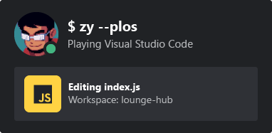

<div align='center'></div>
<br>
<h1 align='center'>Discord Badge</h1>
<h3 align='center'>a useful tool to display what you're doing on Discord.</h3> 

## Getting Started
1. First, get the repository on your device. `git clone https://github.com/VillainsRule/Discord-Badge.git && cd Discord-Badge`.
2. Next, install dependencies. `npm i`.
3. Next, configure variables. More information is below.
4. Finally, run the program! `node .`

## Configuring variables
First, open the `.env.example` file. Rename it to `.env`. This is where you will control your variables.<br>
Next, fill out the variables. Here's my `.env`:

```js
BOT_TOKEN='MTExxxxxxxxxxxxxxxxxxxxxxxxxxxxxxxxxxxxxxxxxxxxxxxxxxxxxxxxxxxxxxxxxxxxx'
GUILD_ID='00000000000000000000'
ALLOWED_USERS='0,1,2,3,4,5'
NOT_FOUND_REDIRECT_LINK='https://example.com'
PORT=4000
```

The first line contains a Discord bot token.<br>
The next line contains the Guild ID all the users you want to check and the Bot are in.<br>
The allowed users is a list separated by a comma of user IDs that can be checked. Leave this blank to allow anyone.<br>
The not found redirect link is fairly stupid, it's just a link to redirect to on all pages where there's NOT a card to send.<br>
The port is where the application is. `http://localhost:[port]`.

## Using It
```

```

## Card Previews
If you're on VSCode or something sharing a Rich Presence, it will look something like this:<br>


If you're playing a game without a Rich Presence, it will look something like this:<br>


If you're not sharing anything, it will look something like this:<br>


## Credits
- The card, images, and idea are from [@Zyplos](https://github.com/Zyplos) in his project [discord-readme-badge](https://github.com/Zyplos/discord-readme-badge).
- The entire codebase and contents of the README were written by me, thonk.